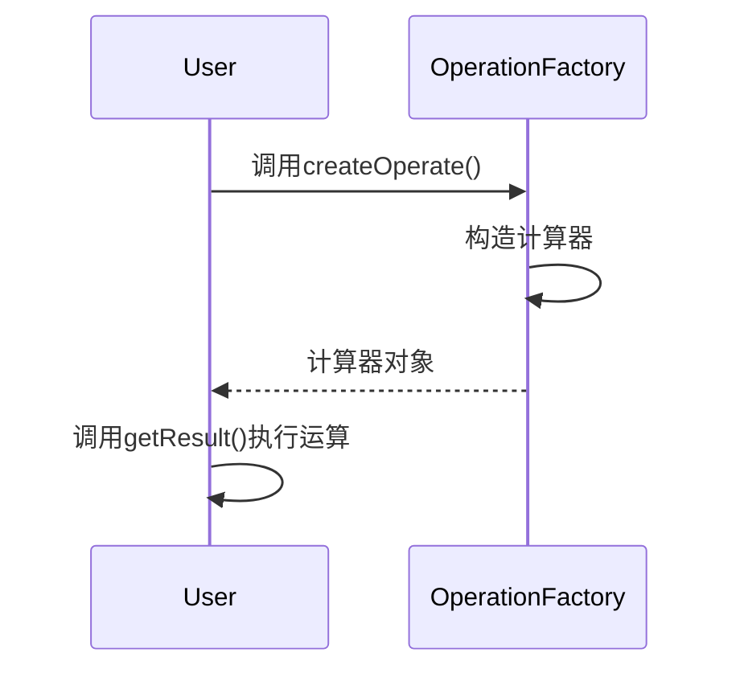

```mermaid
    sequenceDiagram
    participant u as User
    participant of as OperationFactory
    u ->> of: 调用createOperate()
    of ->> of: 构造计算器
    of -->> u: 计算器对象
    u ->> u: 调用getResult()执行运算
```